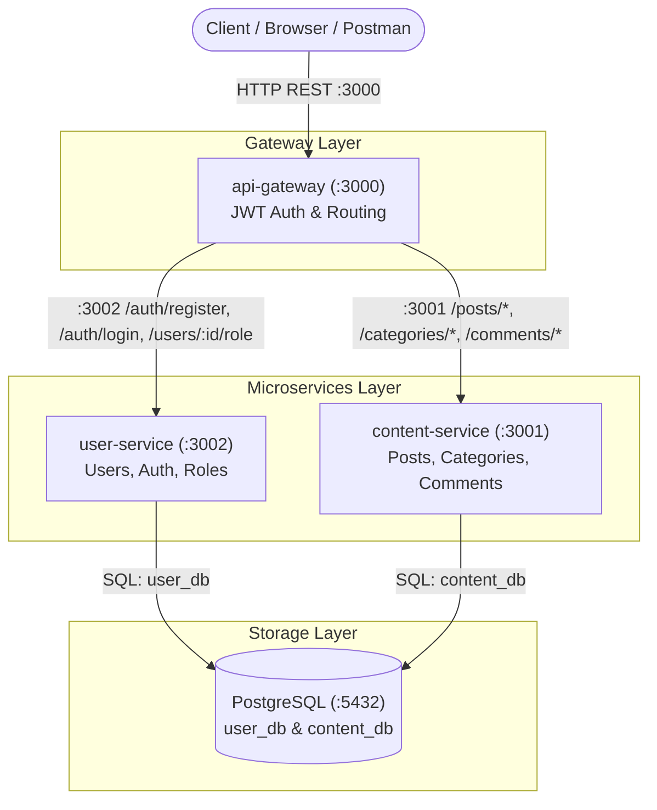

# System Architecture — Blog / CMS Platform

```mermaid
graph TD
  Client([Client / Browser / Postman])

  subgraph Gateway Layer
    GW["api-gateway (:3000)<br/>JWT Auth & Routing"]
  end

  subgraph Microservices Layer
    US["user-service (:3002)<br/>Users, Auth, Roles"]
    CS["content-service (:3001)<br/>Posts, Categories, Comments"]
  end

  subgraph Storage Layer
    PG[("PostgreSQL (:5432)<br/>user_db & content_db")]
  end

  Client -->|"HTTP REST :3000"| GW
  GW -->|":3002 /auth/register, /auth/login, /users/:id/role"| US
  GW -->|":3001 /posts/*, /categories/*, /comments/*"| CS
  US -->|"SQL: user_db"| PG
  CS -->|"SQL: content_db"| PG
```
